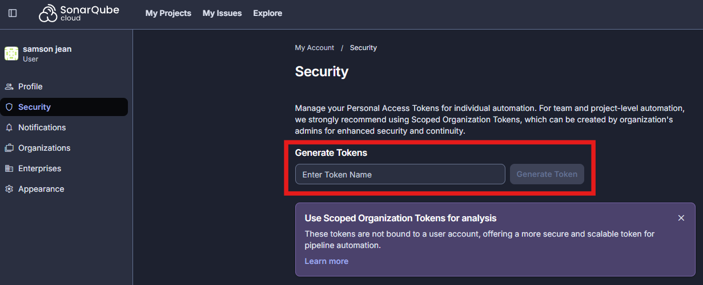
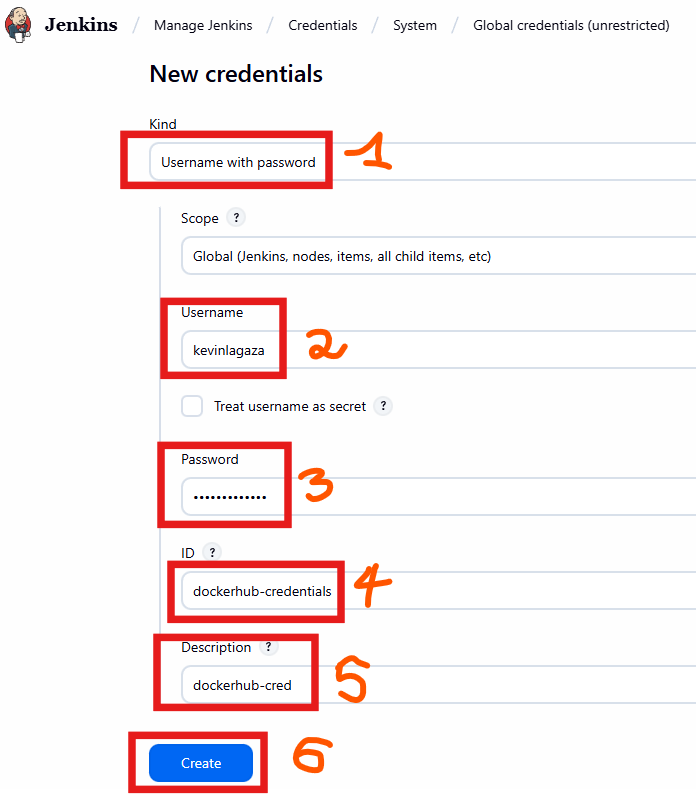
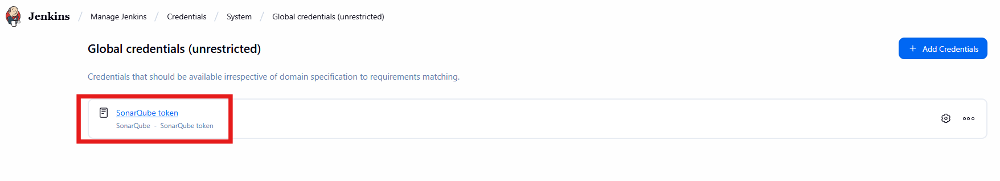
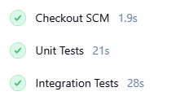
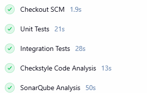
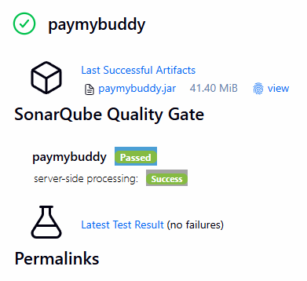
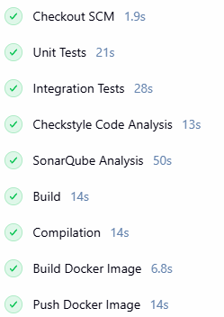
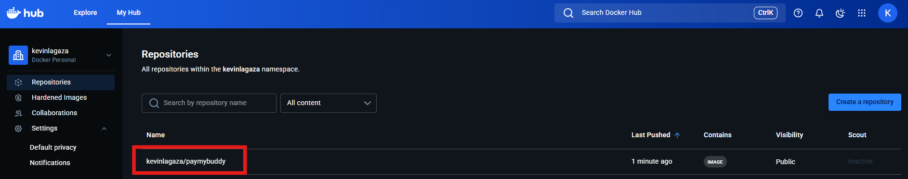

# Jenkins CI_CD Pipeline

## Getting started

The objective of this project is to design a **Continuous Integration (CI)** and **Continuous Deployment (CD)** pipeline for deploying a  [Spring Boot application](https://github.com/eazytraining/PayMyBuddy) on AWS. We will implement the necessary steps to ensure code quality and security while automating the deployment process. Here is the git workflow:
* On the main branch **(main)**, all stages must be executed, except the review deployment.

* On **other branches**, only the following stages must be executed:

    - Automated Tests
    - Code Quality Check
    - Build and Packaging

## Prerequisites

Recall that whether you are running Jenkins on a host machine or docker container, make sure that **docker** is installed. 

1) SonarCloud

Create a sonarcloud account and generate a token that will be used in Jenkins. 

****

2) Jenkins

---
a) Install the following plugins:

* Docker Pipeline
* SonarQube Scanner (for static code analysis)
* Slack Notification (for notification)
* SSH Agent (for deployment)

b) Add dockerhub and sonarcloud credentials

****

****

## 1) Automated testing

We will execute unitary and integration tests.

****

***

## 2) Code quality

We want to perform a static analysis of the code using SonarCloud. First, make sure to add the sonar token (done in the prerequisites' section) in the global credentials.  

****

****

## 3) Compilation and Packaging

Now, we want to build the jar file, then build the docker image and push the latter into DockerHub.

****

****

## 4) Deployment in staging environment

## 5) Deployment in production environment

## 6) Validation tests

