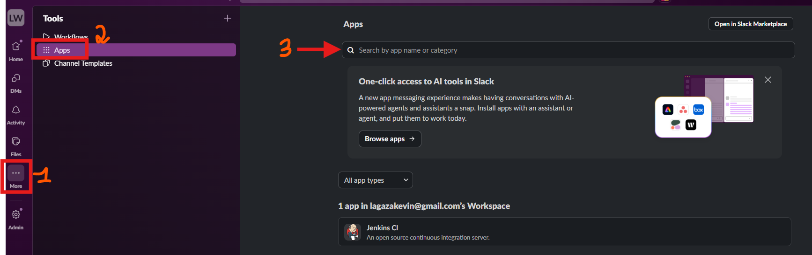
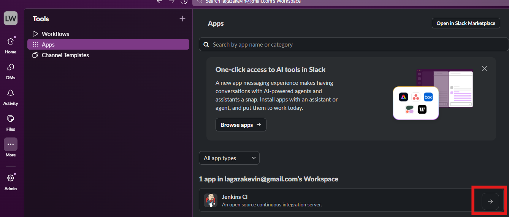
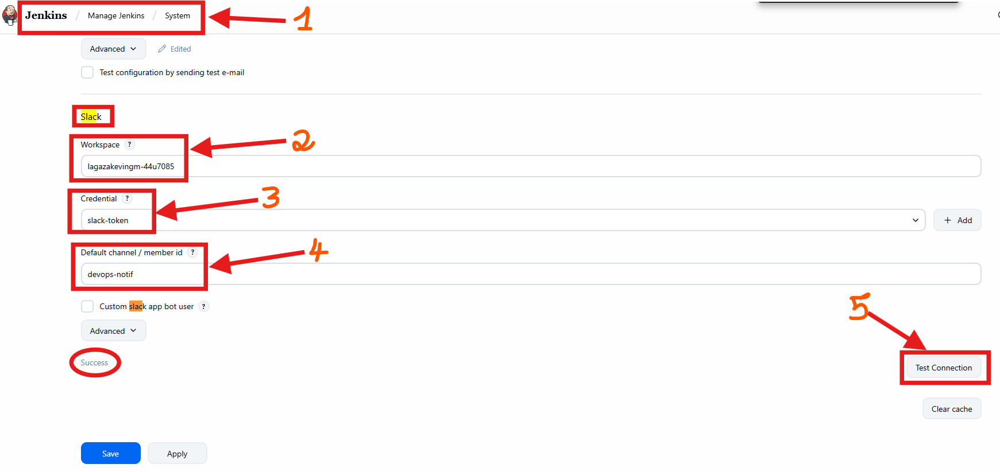
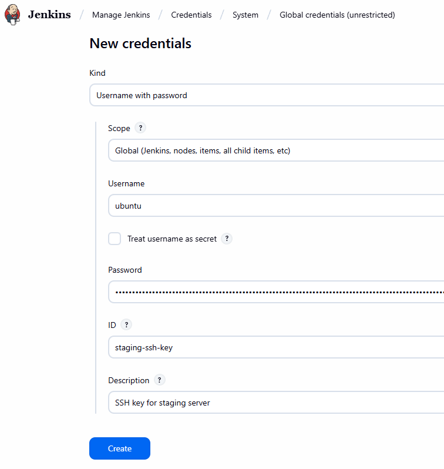
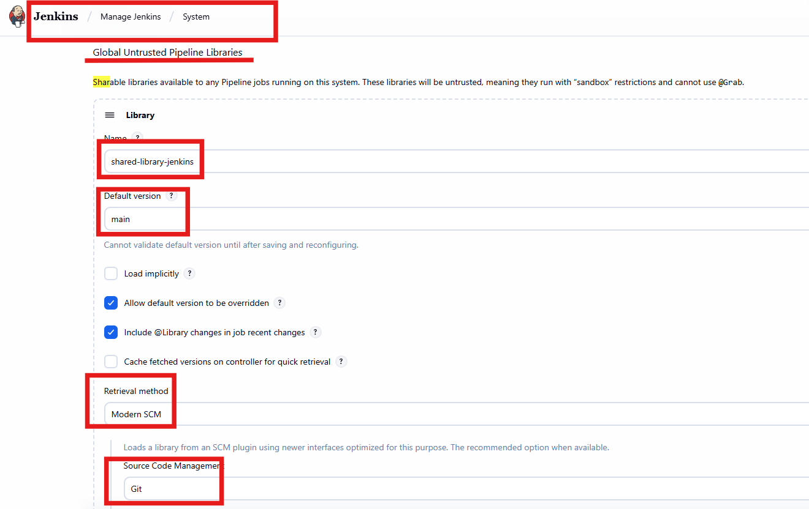
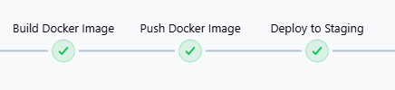
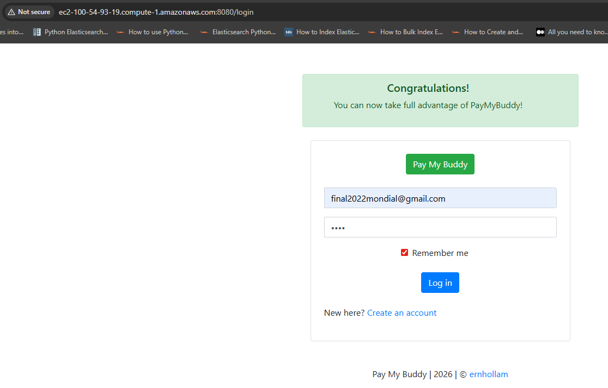
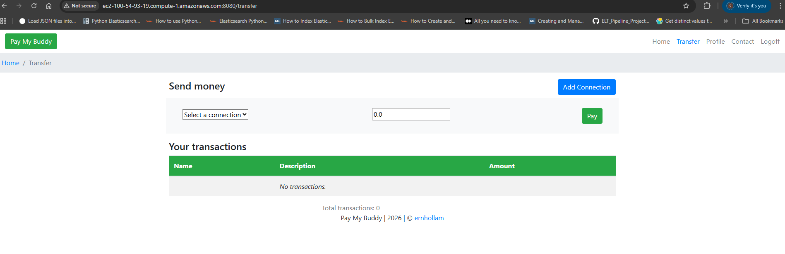
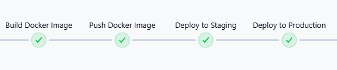
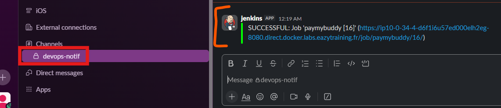

# Jenkins CI_CD Pipeline

## Getting started

The objective of this project is to design a **Continuous Integration (CI)** and **Continuous Deployment (CD)** pipeline for deploying a  [Spring Boot application](https://github.com/eazytraining/PayMyBuddy) on AWS. We will implement the necessary steps to ensure code quality and security while automating the deployment process. Here is the git workflow:
* On the main branch **(main)**, all stages must be executed, except the review deployment.

* On **other branches**, only the following stages must be executed:

    - Automated Tests
    - Code Quality Check
    - Build and Packaging

## Prerequisites

Recall that whether you are running Jenkins on a host machine or docker container, make sure that **docker** is installed.

**1) SonarCloud**

Create a sonarcloud account and generate a token that will be used in Jenkins. 

****

**2) Jenkins**

---
a) Install the following plugins:

* **Docker Pipeline**
* **SonarQube Scanner** (for static code analysis)
* **SSH Agent** (for deployment)
* **Slack Notification** (for notification)

b) Add the following credentials:

**For global scope**:

- staging-host
- production-host
- db-root-pwd
- sonar-project-key

**For Jenkins scope**:
- staging-ssh-key
- production-ssh-key

**3) Slack**

- Step 1: Create a channel where notifications will be sent 
- Step 2: Choose Jenkins from Apps to be installed and click on arrow **Go to app**

****

****

- Step 3: Retrieve the **Team Subdomain** and **Integration Token Credential ID** (under Global scope) to be added in Jenkins credentials and during the configuration. Then, test the connection to ensure that it works well

****

b) Add **dockerhub** and **sonarcloud** credentials under Global scope

****

****

c) Add **STAGING_SSH_KEY** and **PRODUCTION_SSH_KEY** credentials under Jenkins scope

****

**4) Shared library**

The idea is to group some reusable functions that can be adapted in the Jenkinsfile. In our case, the functions are located in this [repo](https://github.com/KevinLagaza/shared-library-jenkins.git). Then, follow the instructions as mentionned below:

- Step 1: Create a repository that contains all the files present in [repo](https://github.com/KevinLagaza/shared-library-jenkins.git)
- Step 2: Configure the aforementioned repository in Jenkins to retrieve the libraries

****

## **1) Automated testing**

We will execute unitary and integration tests.

****

***

## **2) Code quality**

We want to perform a static analysis of the code using SonarCloud. First, make sure to add the sonar token (done in the prerequisites' section) in the global credentials.  

****

****

## **3) Compilation and Packaging**

Now, we want to build the jar file, then build the docker image and push the latter into DockerHub.

****

****

## **4) Deployment and Validation in staging environment**

****

****

****

## **5) Deployment and Validation in production environment**

****

## **6) Slack notification**

After the deloyment in both environments, we will get notified about whether it is successful or failed.

****

