# 🚀 Jenkins CI/CD Pipeline

Automated Continuous Integration and Continuous Deployment pipeline for a Spring Boot application on AWS.

---

## 📋 Table of Contents

- [Overview](#-overview)
- [Architecture](#-architecture)
- [Git Workflow](#-git-workflow)
- [Prerequisites](#-prerequisites)
  - [SonarCloud Setup](#1-sonarcloud-setup)
  - [Jenkins Configuration](#2-jenkins-configuration)
  - [Slack Integration](#3-slack-integration)
  - [Shared Library](#4-shared-library)
- [Pipeline Stages](#-pipeline-stages)
  - [Stage 1: Automated Testing](#stage-1-automated-testing)
  - [Stage 2: Code Quality Analysis](#stage-2-code-quality-analysis)
  - [Stage 3: Build and Packaging](#stage-3-build-and-packaging)
  - [Stage 4: Staging Deployment](#stage-4-staging-deployment)
  - [Stage 5: Production Deployment](#stage-5-production-deployment)
  - [Stage 6: Notifications](#stage-6-notifications)
- [Troubleshooting](#-troubleshooting)

---

## 🎯 Overview

This project implements a complete CI/CD pipeline for deploying a [Spring Boot application (PayMyBuddy)](https://github.com/eazytraining/PayMyBuddy) on AWS infrastructure. The pipeline ensures code quality, security, and automated deployment across staging and production environments.

### ✨ Features

| Feature | Description |
|---------|-------------|
| 🧪 **Automated Testing** | Unit and integration tests execution |
| 🔍 **Code Quality** | Static code analysis with SonarCloud |
| 🐳 **Docker Integration** | Containerized builds and Docker Hub publishing |
| 🚀 **Multi-Environment** | Staging and production deployments |
| 📢 **Notifications** | Real-time Slack alerts |
| 📚 **Shared Libraries** | Reusable Jenkins pipeline functions |

---

## 🏗️ Architecture
```
┌─────────────────────────────────────────────────────────────────────────────┐
│                            CI/CD PIPELINE FLOW                               │
├─────────────────────────────────────────────────────────────────────────────┤
│                                                                              │
│   ┌──────────┐    ┌──────────┐    ┌──────────┐    ┌──────────┐             │
│   │  GitHub  │───▶│ Jenkins  │───▶│  Build   │───▶│  Test    │             │
│   │   Push   │    │ Trigger  │    │   Job    │    │   Job    │             │
│   └──────────┘    └──────────┘    └──────────┘    └──────────┘             │
│                                                          │                  │
│                                                          ▼                  │
│   ┌──────────┐    ┌──────────┐    ┌──────────┐    ┌──────────┐             │
│   │  Slack   │◀───│Production│◀───│ Staging  │◀───│  Sonar   │             │
│   │  Notify  │    │  Deploy  │    │  Deploy  │    │  Scan    │             │
│   └──────────┘    └──────────┘    └──────────┘    └──────────┘             │
│                         │               │                                   │
│                         ▼               ▼                                   │
│                   ┌──────────┐    ┌──────────┐                              │
│                   │   AWS    │    │   AWS    │                              │
│                   │   Prod   │    │  Staging │                              │
│                   └──────────┘    └──────────┘                              │
│                                                                              │
└─────────────────────────────────────────────────────────────────────────────┘
```

---

## 🔀 Git Workflow

The pipeline behavior varies based on the branch:

| Branch | Stages Executed |
|--------|-----------------|
| `main` | ✅ All stages (except review deployment) |
| `other branches` | ✅ Automated Tests ✅ Code Quality ✅ Build & Packaging |
```
┌─────────────────────────────────────────────────────────────────┐
│                        BRANCH STRATEGY                          │
├─────────────────────────────────────────────────────────────────┤
│                                                                 │
│   feature/* ──┐                                                 │
│               │    ┌─────────┐    ┌─────────┐    ┌─────────┐   │
│   bugfix/*  ──┼───▶│  Test   │───▶│ Quality │───▶│  Build  │   │
│               │    └─────────┘    └─────────┘    └─────────┘   │
│   hotfix/*  ──┘                                                 │
│                                                                 │
│                              │                                  │
│                              ▼ (merge)                          │
│                                                                 │
│   main ─────────────────────────────────────────────────────▶   │
│         Test → Quality → Build → Staging → Approval → Prod     │
│                                                                 │
└─────────────────────────────────────────────────────────────────┘
```

---

## 🔧 Prerequisites

> ⚠️ **Important:** Ensure Docker is installed on your Jenkins host (machine or container).

### 1. SonarCloud Setup

Create a SonarCloud account and generate an authentication token:

1. Go to [SonarCloud](https://sonarcloud.io/)
2. Navigate to **My Account** → **Security**
3. Generate a new token for Jenkins integration

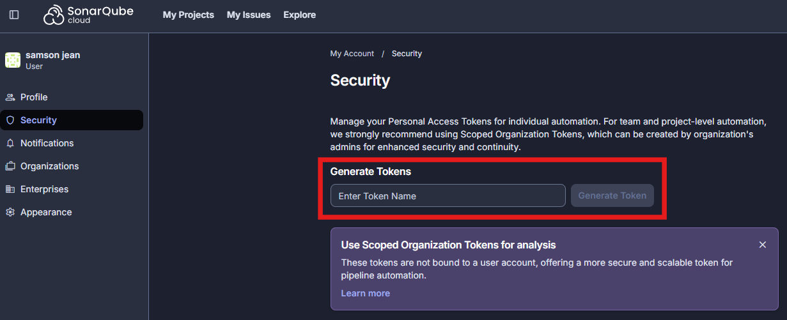

---

### 2. Jenkins Configuration

#### 📦 Required Plugins

| Plugin | Purpose |
|--------|---------|
| Docker Pipeline | Docker build and push support |
| SonarQube Scanner | Static code analysis |
| SSH Agent | Secure deployment connections |
| Slack Notification | Build status alerts |

#### 🔐 Credentials Setup

**Global Scope Credentials:**

| Credential ID | Type | Description |
|---------------|------|-------------|
| `staging-host` | Secret text | Staging server hostname/IP |
| `production-host` | Secret text | Production server hostname/IP |
| `db-root-pwd` | Secret text | Database root password |
| `sonar-project-key` | Secret text | SonarCloud project key |
| `dockerhub-credentials` | Username/Password | Docker Hub login |
| `sonarcloud-token` | Secret text | SonarCloud authentication |
| `slack-token` | Secret text | Slack integration token |

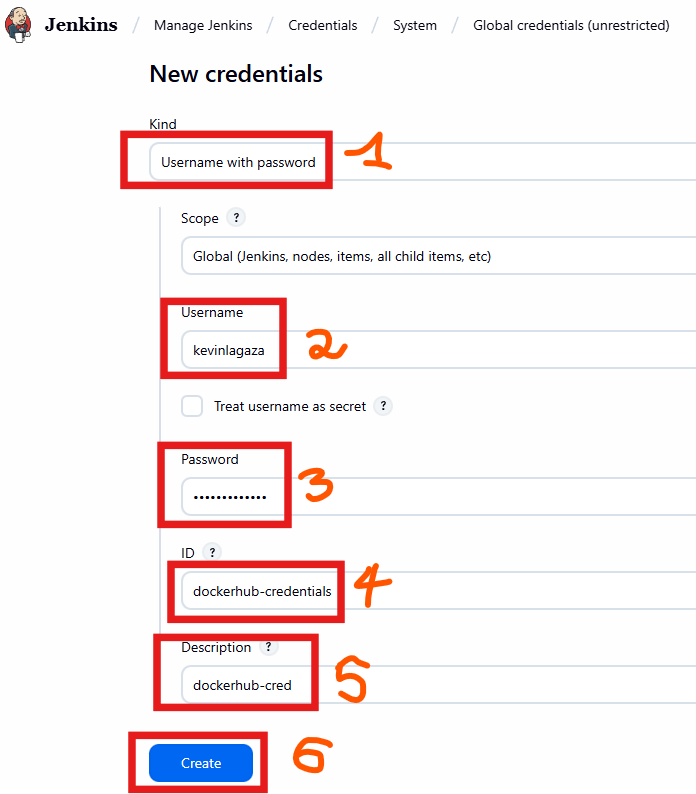

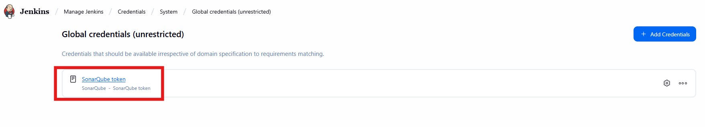

**Jenkins Scope Credentials:**

| Credential ID | Type | Description |
|---------------|------|-------------|
| `staging-ssh-key` | SSH Username with private key | Staging server access |
| `production-ssh-key` | SSH Username with private key | Production server access |

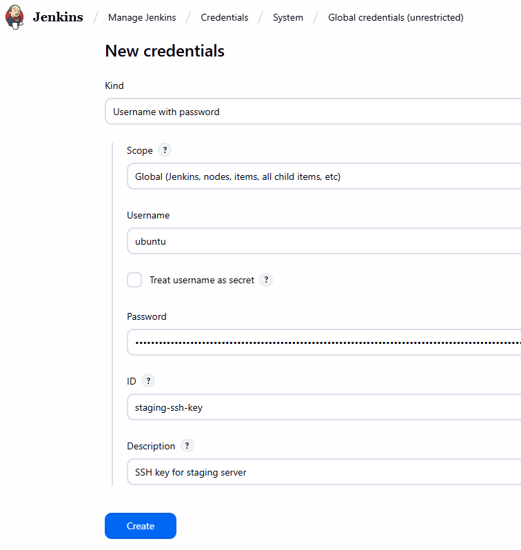

---

### 3. Slack Integration

#### Step 1: Create Notification Channel

Create a dedicated Slack channel for CI/CD notifications.

#### Step 2: Install Jenkins App

Navigate to Slack Apps and install the Jenkins CI app:

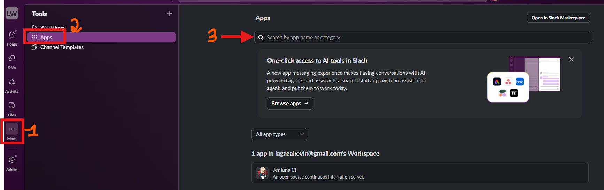

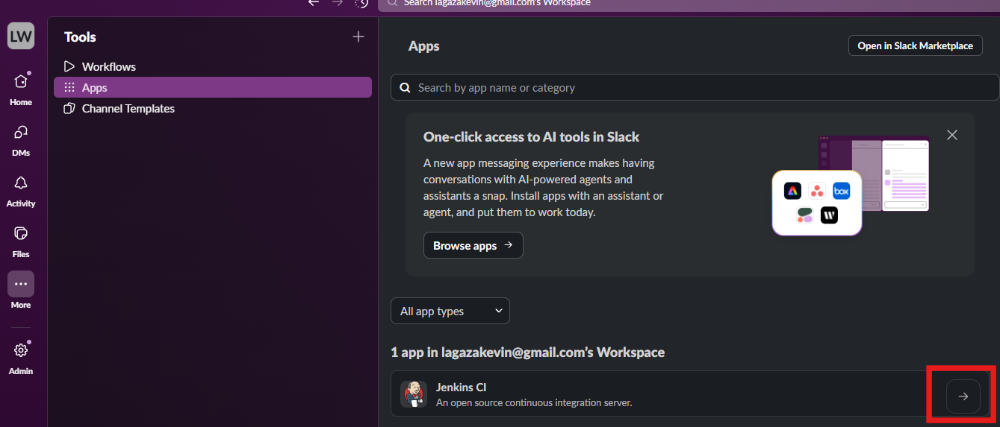

#### Step 3: Configure Integration

Retrieve the following from Slack:
- **Team Subdomain**
- **Integration Token Credential ID**

Add these to Jenkins and test the connection:

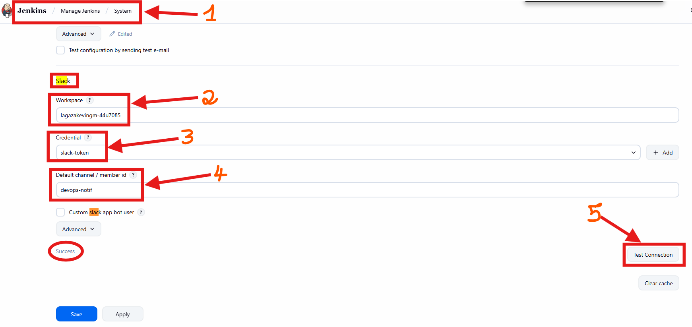

---

### 4. Shared Library

The pipeline uses reusable functions from a shared library for cleaner and maintainable code.

#### 📚 Library Repository

[https://github.com/KevinLagaza/shared-library-jenkins.git](https://github.com/KevinLagaza/shared-library-jenkins.git)

#### Configuration Steps

1. Fork or clone the shared library repository
2. Configure the library in Jenkins:

   **Manage Jenkins** → **Configure System** → **Global Pipeline Libraries**

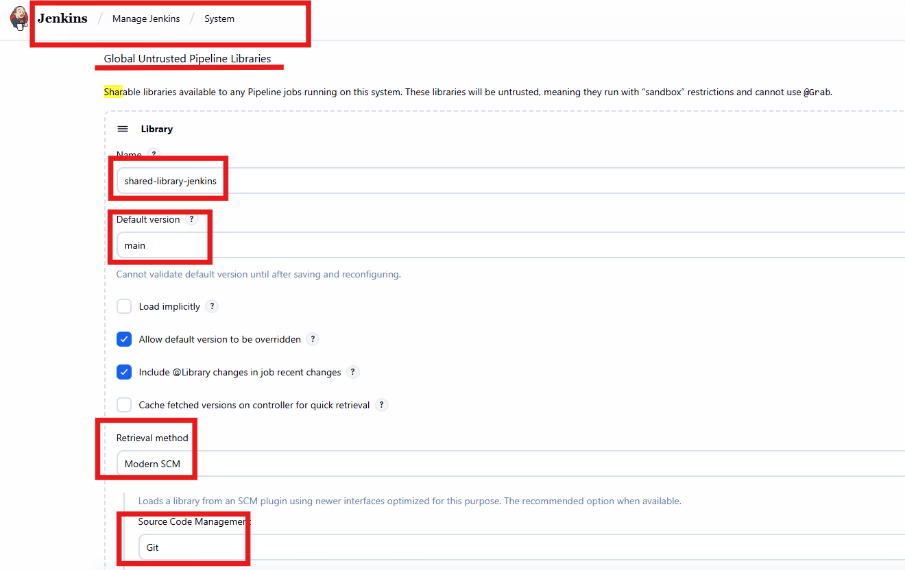

#### 📁 Library Structure
```
shared-library-jenkins/
└── vars/
    ├── deployToEnvironment.groovy   # Deployment function
    ├── testEnvironment.groovy       # Environment testing
    └── slackNotifier.groovy         # Slack notifications
```

---

## 🔄 Pipeline Stages

### Stage 1: Automated Testing

Executes unit and integration tests to ensure code reliability.
```groovy
stage('Unit Tests') {
    steps {
        sh 'mvn test'
    }
}

stage('Integration Tests') {
    steps {
        sh 'mvn verify -Pintegration-tests'
    }
}
```

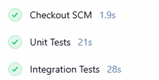

✅ **Success Criteria:** All tests pass with no failures.

---

### Stage 2: Code Quality Analysis

Performs static code analysis using SonarCloud to identify bugs, vulnerabilities, and code smells.
```groovy
stage('SonarQube Analysis') {
    steps {
        withSonarQubeEnv('SonarCloud') {
            sh 'mvn sonar:sonar'
        }
    }
}
```

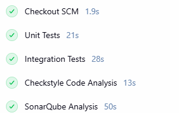

#### 📊 Analysis Results

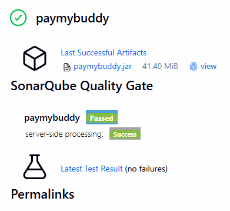

✅ **Success Criteria:** Quality gate passed, no critical issues.

---

### Stage 3: Build and Packaging

Builds the JAR file, creates a Docker image, and pushes it to Docker Hub.
```groovy
stage('Build') {
    steps {
        sh 'mvn package -DskipTests'
    }
}

stage('Docker Build & Push') {
    steps {
        script {
            docker.build("${DOCKER_IMAGE}:${BUILD_NUMBER}")
            docker.push()
        }
    }
}
```

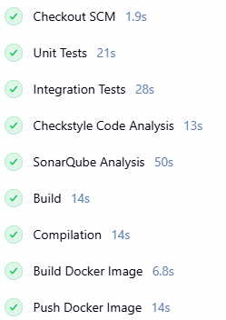

#### 🐳 Docker Hub

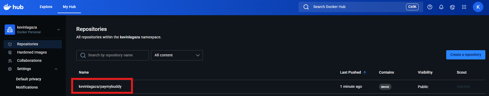

✅ **Success Criteria:** JAR built, Docker image pushed successfully.

---

### Stage 4: Staging Deployment

Deploys the application to the staging environment for validation.
```groovy
stage('Deploy to Staging') {
    when {
        branch 'main'
    }
    steps {
        deployToEnvironment(
            host: STAGING_HOST,
            sshCredentialId: 'staging-ssh-key'
        )
    }
}
```

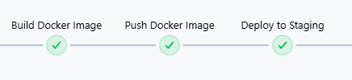

#### 🌐 Staging Application

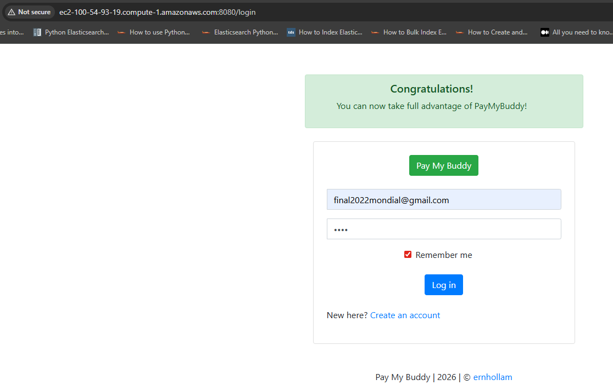

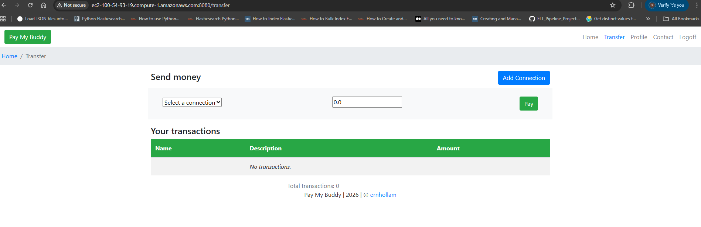

✅ **Success Criteria:** Application accessible and functional in staging.

---

### Stage 5: Production Deployment

After staging validation and approval, deploys to production.
```groovy
stage('Deploy to Production') {
    when {
        branch 'main'
    }
    steps {
        input message: 'Deploy to Production?', ok: 'Deploy'
        deployToEnvironment(
            host: PRODUCTION_HOST,
            sshCredentialId: 'production-ssh-key'
        )
    }
}
```

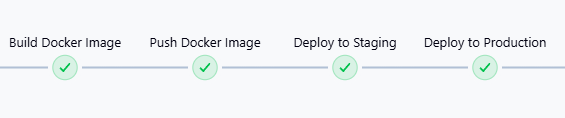

✅ **Success Criteria:** Application live in production.

---

### Stage 6: Notifications

Sends build status notifications to Slack after pipeline completion.
```groovy
post {
    success {
        slackNotifier('SUCCESS')
    }
    failure {
        slackNotifier('FAILURE')
    }
}
```

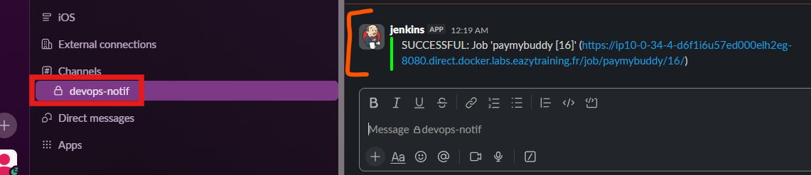

✅ **Notifications:** Team informed of build status in real-time.

---

## 🛠️ Troubleshooting

| Issue | Possible Cause | Solution |
|-------|----------------|----------|
| Docker build fails | Docker not installed | Install Docker on Jenkins host |
| SonarQube timeout | Network issues | Check firewall and SonarCloud connectivity |
| SSH connection refused | Wrong credentials | Verify SSH keys and host configuration |
| Slack notifications fail | Invalid token | Regenerate Slack integration token |
| Tests fail | Code issues | Review test logs and fix failing tests |

### 🔍 Useful Commands
```bash
# Check Jenkins logs
docker logs jenkins

# Verify Docker connectivity
docker info

# Test SSH connection
ssh -i key.pem user@staging-host

# Check SonarQube status
curl -u token: https://sonarcloud.io/api/system/status
```

---

## 📚 Resources

- [Jenkins Pipeline Documentation](https://www.jenkins.io/doc/book/pipeline/)
- [SonarCloud Documentation](https://docs.sonarcloud.io/)
- [Docker Pipeline Plugin](https://plugins.jenkins.io/docker-workflow/)
- [Slack Jenkins Integration](https://slack.com/apps/A0F7VRFKN-jenkins-ci)

---

## 👨‍💻 Author

**Kevin Lagaza**

---

## 📄 License

This project is licensed under the MIT License.